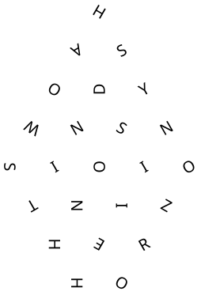

# Chain

> 

这关的题目 Chain 暗示了这些字母可能连成一个词或句子。

既然如此，字母的方向就可能意味着不同字母间接续的关系。有可能字母的“头”指向下一个，也有可能字母的“尾”指向下一个。

但是，有些字母高度对称，比如 I, O, H, S, Z，它们的方向有多种可能性，所以需要你多做些尝试才能解出来。

另外，有些玩家不慎把 W 认成 M 了，但其实它们在字体上是有显著差别的。

这题可以编程求解或者硬看，硬看也不难。

另外有玩家提及，题面的 SVG 文件本身就暴露了字母的顺序，这点我确实始料未及，早知该用 PNG 的。

## 编程求解

把一些字母连成一条线，这是一个 Halmilton 路径问题，可以运用一些图论知识求解。

```cpp
#include<iostream>
#include<vector>
#include<string>
std::vector<char> info{'H','S','Y','N','O','A','D','S','I','Z','O','N','O','I','R','W','I','N','E','O','S','T','H','H'};//以H,S,Y,N,O为第一行，从此处开始，记录每个下标对应的字符
std::vector<std::vector<int>> edges{
    {5},{0,2},{1},{2,4},{3},
    {6},{10},{2,12},{7,9},{4,14},
    {5,15},{10,12},{8,16},{9,17},{13},
    {20},{15,17},{21,13},{23},{14},
    {16},{22},{18},{19},
};//以邻接表的形式记录有向图
void bfs(int node,int depth){
    static std::string stack(info.size(),0);
    static std::vector<bool> visited(info.size(),false);
    if(visited[node])
        return;
    visited[node]=true;
    stack[depth]=info[node];
    std::clog<<stack<<std::endl;
    if(depth==info.size()-1)
        std::cout<<stack<<std::endl;
    else
        for(int next:edges[node])
            bfs(next,depth+1);
    stack[depth]=0;
    visited[node]=false;
}//通过深度优先搜索，找寻所有可能的解
int main(){
    bfs(11,0);//通过观察，发现只有编号11的节点是没有入度的；因此，它必然是搜索的起点
    return 0;
}
```

执行一下会发现，所有字母都出现的结果只有 `NOISYSHADOWSINTHEHORIZON` 一种（当然也有可能是倒过来的），所以答案就是 `noisy shadows in the horizon`（大小写不敏感，也不强求打空格）。
