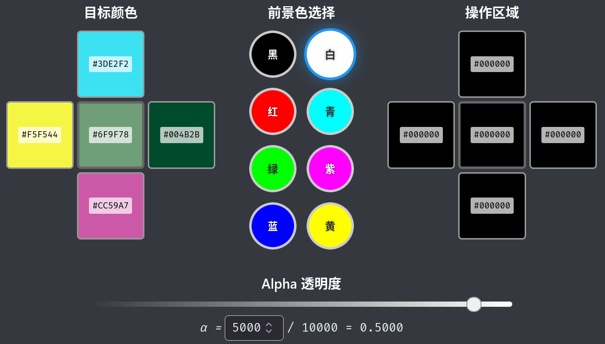
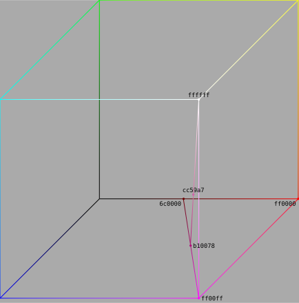
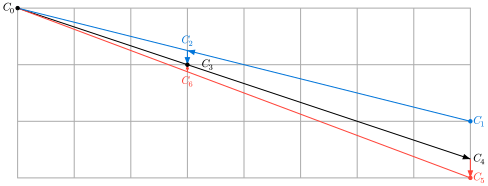
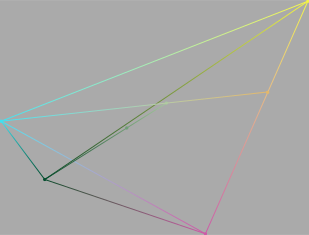

# ColorBlending

> 在由五个方块构成的十字形中，每个方块都有一个特定颜色。
>
> 你可以通过在方块上添加 $\alpha$ 透明度的前景色进行颜色合成，从而改变方块颜色。
>
> 你可以选择的前景色只有 8 种：黑、白、红、绿、蓝、青、紫、黄。
>
> 请注意：你可以任意选择十字形的四个边缘方块进行颜色堆叠，而中心方块总会受到相同的堆叠效果。
>
> 你需要把操作区内每个方块的颜色都变成和目标颜色完全相同，才可以通关。
>
> 

这关大家搞出了思路各异的玩法，可以说是本次解谜的精华题，让我找到了当年 [Art](../../gui-mao/art/art.md) 那题大家八仙过海的感觉。

本关可行的解法多种多样。它们的思路大致可以分为以下三类：
- [微调](#微调解法)
- [插值](#插值解法)
- [搜索](#搜索解法)

## 微调解法

<iframe src="//player.bilibili.com/player.html?isOutside=true&aid=116089946114139&bvid=BV1H6ZQBFEWz&cid=36136551059&p=1" scrolling="no" border="0" frameborder="no" framespacing="0" allowfullscreen="true"></iframe>

这是我在一开始出题时构思的解法。它是相当麻烦的方法，但对玩家要求最低。你哪怕什么都不会，也可以解开本题。

我的论证过程可能有些冗长，但一定严谨。

### TL;DR

你会发现，当你使用较小的 $\alpha$ 时，如果前景色选择得当，你可以做到只改变一个颜色的某一个分量，而保持其它分量不变。

更进一步，你也可以做到只改变一个颜色，而另一个颜色不变。

恭喜，你已经知道了怎么解题，现在就去搞定它吧！

---

中心方块的颜色受到的影响太多，不方便研究，我们先来考虑最简单的情况：**只给定一个方块，如何合成目标颜色？**

### 基本公式和运算符

一个颜色是一个三维向量，可以使用 $C=(R,G,B)$ 表示它。

根据[维基百科](https://en.wikipedia.org/wiki/Alpha_compositing#Description)我们查到，在背景色 $(R_0,G_0,B_0)$ 上叠加 $\alpha$ 透明度的前景色 $(r,g,b)$，得到的新颜色 $(R,G,B)$ 为（当然，如果颜色值域是离散的，那么结果值也会进行舍入）：

$$
(R,G,B)=\alpha(r,g,b)+(1-\alpha)(R_0,G_0,B_0)\tag{1}
$$

为了易于表示，我们定义一个新运算 $\oplus_\alpha$，表示以左操作数为背景色，叠加 $\alpha$ 透明度的右操作数作为前景色。那么上面的公式也可以表示成

$$
(R,G,B)=(R_0,G_0,B_0)\oplus_\alpha(r,g,b)\tag{2}
$$

我们简单分析一下 $\oplus_\alpha$ 的性质。对于任意给定的 $\alpha$，

$$
C_1\oplus_\alpha C_2=\alpha C_2+(1-\alpha)C_1\ne\alpha C_1+(1-\alpha)C_2=C_2\oplus_\alpha C_1
$$

所以它不满足交换律；对于任意给定的 $\alpha,\beta$，

$$
(C_1\oplus_\alpha C_2)\oplus_\beta C_3=(1-\alpha)(1-\beta)C_1+\alpha(1-\beta)C_2+\beta C_3\\
C_1\oplus_\alpha(C_2\oplus_\beta C_3)=(1-\alpha)C_1+\alpha(1-\beta)C_2+\alpha\beta C_3
$$

所以它不满足结合律，对于任意给定的 $\alpha\ne1$，

$$
C_1\oplus_\alpha C=C_2\oplus_\alpha C\\
\Rightarrow\alpha C+(1-\alpha)C_1=\alpha C+(1-\alpha)C_2\\
\Rightarrow C_1=C_2
$$

说明如果 $\alpha\ne1$ 它满足消去律；对于任意给定的 $\alpha$，

$$
C\oplus_\alpha C=\alpha C+(1-\alpha)C=C
$$

所以它满足幂等律。

### 舍入逼近

先来思考一个问题：从 $(129,129,0)$ 出发，如何构造 $(129,128,0)$？

如果选择 $(0,0,0)$ 作为前景色，那就存在一个问题：R 分量和 G 分量会同步增长，结果就是 $(129,128,0)\oplus_\alpha(0,0,0)=(128,128,0)$，其中 $\alpha=0.9922$。

而如果选择 $(255,0,0)$ 作为前景色，我们就需要找到一个 $\alpha$ 使得 $(129,129,0)\oplus_{\alpha}(255,0,0)=(129,128,0)$，那我们就可以解方程组：

$$
\begin{cases}
\alpha\cdot255+(1-\alpha)\cdot129=129\\
\alpha\cdot0+(1-\alpha)\cdot129=128\\
\end{cases}\Rightarrow\begin{cases}
\alpha=0\\
\alpha\approx0.0078
\end{cases}
$$

这个 $\alpha$ 似乎是无解的。但还有一个重要问题被我们忽视了：**计算结果的舍入**。

还是以 $(129,129,0)$ 作背景色，我们取 $(255,0,0)$ 作前景色。我们知道，当 $\alpha=0$ 时，结果是 $(129,129,0)$；当 $\alpha=0.0078$ 时，结果是 $(130,128,0)$；可当 $0<\alpha<0.078$ 时呢？

以 $\alpha=0.0039$ 为例：我们发现

$$
(129,129,0)\oplus_{0.0039}(255,0,0)=(129.491,128.497,0)
$$

16 比特位的色号无法支持小数，那么在遇到此类情况时，程序会如何处理呢？你实测一下就会发现它最后变成了 $(129,128,0)$，用的是[四舍六入](https://zh.wikipedia.org/wiki/%E5%A5%87%E9%80%B2%E5%81%B6%E6%8D%A8)的规则。

如果取 $\alpha=0.0038$ 或者 $\alpha=0.004$，我们就会得到

$$
(129,129,0)\oplus_{0.0038}(255,0,0)=(129.479,128.51,0)\approx(129,129,0)\\
(129,129,0)\oplus_{0.0040}(255,0,0)=(129.504,128.484,0)\approx(130,128,0)\\
$$

这个 $\alpha$ 的取值很湊巧，多一点或者少一点都会得不到我们想要的结果；而恰恰是 $0.0039$ 这个值帮我们成功构造出了 $(129,128,0)$。

这个值是通过解以下不等式得到的：

$$
\begin{cases}
\alpha\cdot255+(1-\alpha)\cdot129<129.5\\
\alpha\cdot0+(1-\alpha)\cdot129<128.5\\
\end{cases}\Rightarrow\begin{cases}
\alpha<0.00397\\
\alpha>0.00388
\end{cases}\Rightarrow\alpha=0.0039
$$

**利用结果舍入来逼近我们希望达到的颜色**，是整个谜题的最核心方法。

但是别高兴太早，我们再来思考一个问题：只用一步操作，可以将 $(129,129,0)$ 变成 $(130,129,0)$ 吗？

使用以上思路进行计算，我们选取 $(255,255,0)$ 作为前景色，列出以下不等式：

$$
\begin{cases}
\alpha\cdot255+(1-\alpha)\cdot129>129.5\\
\alpha\cdot255+(1-\alpha)\cdot129<129.5
\end{cases}
$$

不用往下做，一眼就看得出这个式子它是无解的。

但我们仍可能通过多步操作到达 $(130,129,0)$。我们只需先将 $(129,129,0)$ 变成 $(130,130,0)$，然后再把 $(130,130,0)$ 转化成 $(130,129,0)$ 即可。

$$
(129,129,0)\oplus_{0.0079}(255,255,0)\approx(130,130,0)\\
(130,130,0)\oplus_{0.0039}(255,0,0)\approx(130,129,0)
$$

我们发现，由 $(129,129,0)$ 是无法一步到达 $(130,129,0)$ 的；但由 $(130,130,0)$ 却可以一步到达。这说明它们之间一定存在着某种更重要的差异。

为了得到一个完整的方法论，我们还需要做些系统性的思考。

### 分量容忍度

我们先考虑单个维度的分量，比如 $R$ 分量。假定使用的前景色之红色分量为 $255$，那么在 $\alpha$ 较小时 $R$ 的变化量因为小于 $0.5$ 而不发生实质上的改变；而在 $\alpha$ 较大时 $R$ 的变化量因大于 $0.5$ 而发生实质上的改变。

这之间存在一个 $\alpha$ 的临界值，我们先随便找个字母 $\tau_R$ 表示它。$\tau_R$ 的值可以这样计算出来：

$$
\tau_R\cdot255+(1-\tau_R)\cdot129=129+0.5\Rightarrow\tau_R\approx0.00397
$$

因此当 $\alpha<\tau_R$ 时，$R$ 不会改变；当 $\alpha>\tau_R$ 时，$R$ 分量会变大。

同理，如果前景色之红色分量为 $0$，那么 $\alpha$ 也会有一个临界值，我们这次用字母 $\tau_r$ 表示它。$\tau_r$ 的值可以这样计算出来：

$$
\tau_r\cdot0+(1-\tau_r)\cdot129=129-0.5\Rightarrow\tau_r\approx0.00388
$$

因此当 $\alpha<\tau_r$ 时，$R$ 不会改变；当 $\alpha>\tau_R$ 时，$R$ 分量会变小。

**$\tau$ 描述的是一个分量能够容忍多大的 $\alpha$ 对自己起作用，而使自己保持不变的能力**。我们将这种能力定义为一个分量的**分量容忍度**。如果前景色是 $255$，我们用大写字母下标 $\tau_R,\tau_G,\tau_B$；如果前景色是 $0$，我们用小写字母下标 $\tau_r,\tau_g,\tau_b$。

对于一个任意背景色 $C=(R,G,B)$，它都有以下 6 个分量容忍度，可以按以下公式求出：

$$
\begin{cases}
\tau_R=\frac{0.5}{255-R}\\
\tau_G=\frac{0.5}{255-G}\\
\tau_B=\frac{0.5}{255-B}\\
\tau_r=\frac{0.5}{R}\\
\tau_g=\frac{0.5}{G}\\
\tau_b=\frac{0.5}{B}\\
\end{cases}\tag{3}
$$

由这组公式不难看出，**容忍度的大小取决于它到前景色的距离**。比如 $(129,129,0)$，它的六个容忍度分别为

$$
\begin{cases}
\tau_R=\frac{0.5}{255-129}=0.00397\\
\tau_G=\frac{0.5}{255-129}=0.00397\\
\tau_B=\frac{0.5}{255-0}=0.00196\\
\tau_r=\frac{0.5}{129}=0.00388\\
\tau_g=\frac{0.5}{129}=0.00388\\
\tau_b=\frac{0.5}{0}=\infty\\
\end{cases}
$$

$129$ 离 $255$ 更近，容忍度就更高，所以要改变它，需要使用 $0.004$ 的 $\alpha$；而它离 $0$ 更远，容忍度就更低，所以要改变它，只要使用 $0.0039$ 的 $\alpha$ 就够了。正因如此，由 $(129,129,0)$ 出发一步构造 $(129,128,0)$ 才成为可能。

容忍度将为我们带来一个重要结论。真正试过本关的人一定经受过“好不容易控制好一个分量，却又在调节另一个分量时把它给改了”的绝望感。

而由式 (3) 我们知道，一个分量到它的前景色距离越近，容忍度越高。容忍度高就意味着它不容易被改变。

因此我们如果**先固定那些容忍度高的分量**，再用它们能容忍的 $\alpha$ 去改变那些容忍度低的分量，就可以保证前者不再会受到后者的二次影响。

举个例子。我们希望由黑色 $(0,0,0)$ 出发，得到 $(16,176,127)$。我们发现，$R$ 分量离边界的距离是最近的，那么我们可以先选择白色作为前景色，构造出 $(16,16,16)$。

$$
(0,0,0)\oplus_{0.0627}(255,255,255)=(16,16,16)
$$

接下来我们看到 $176$ 到 $255$ 的距离比 $127$ 到 $0$ 的距离更近，所以应该再设法固定 $G$ 分量。$(10,10,10)$ 的分量容忍度为：

$$
(\tau_r,\tau_G)=(0.03125,0.00209)
$$

所以只要选择 $0,00209<\alpha<0.03125$ 的值然后用 $(0,255,255)$ 一步一步逼近 $(10,176,176)$ 即可。

最后我们处理 $B$ 分量。$(16,176,176)$ 的容忍度为

$$
(\tau_r,\tau_G,\tau_b)=(0.03125,0.00633,0.00284)
$$

所以只要选择 $0.00284<\alpha<0.00633$ 的值然后用 $(0,0,255)$ 一步一步逼近，就能得到 $(16,176,127)$ 了。

---

现在我们可以搞定外围颜色的合成；我们再来看中心颜色的合成。

在合成中心颜色时，我们将遇到更大的麻烦。因为中心颜色的叠加总是与外围颜色同步进行，所以在改变中心颜色的过程中，稍有不慎就会破坏原本已经调整好的外围颜色，且难以复原。

因此我们需要研究一个新的问题：**如何改变一个颜色，同时保持另一个颜色不变**。

### 方向容忍度

在一个 RGB 三维空间上，所有可能的 RGB 值构成了一个正方体。8 种可选前景色位于正方体的八个顶点上。（关于此更详细的论述在下文[插值解法](#插值解法)中）

当我们选择使用某一个前景色进行叠加时，我们的操作其实是把背景色在 RGB 空间中的点向着顶点的方向拉动。

如果我们不希望改变一个颜色，我们就需要使得 $\alpha$ 小于它朝这个方向的每个分量容忍度。举个例子：$(195,64,173)$ 遇到前景色 $(255,0,255)$ 时，要维持不变，使用的 $\alpha$ 不应超过多少？我们可以求出

$$
(\tau_R,\tau_g,\tau_B)=(0.00833,0.00781,0.00610)
$$

所以我们使用的 $\alpha$ 不应超过三者的最小值 $0.00610$，我们用符号 $\tau_{RgB}$ 来记录它。

如果换一个前景色，比如 $(255,0,0)$，我们就应该计算 $\min(\tau_R,\tau_g,\tau_b)=0.00289$，我们用符号 $\tau_{Rgb}$ 来记录它。

看得出来，一个背景色对不同前景色能容忍的 $\alpha$ 值也是不尽相同的。我们定义**方向容忍度**，表示一个背景色对某个前景色（方向）能保持自身不变的最大 $\alpha$ 值。

每个颜色具有八个方向容忍度，它们的公式分别为：

$$
\begin{cases}
\tau_{rgb}=\min(\tau_r,\tau_g,\tau_b)\\
\tau_{Rgb}=\min(\tau_R,\tau_g,\tau_b)\\
\tau_{rGb}=\min(\tau_r,\tau_G,\tau_b)\\
\tau_{rgB}=\min(\tau_r,\tau_g,\tau_B)\\
\tau_{rGB}=\min(\tau_r,\tau_G,\tau_B)\\
\tau_{RgB}=\min(\tau_R,\tau_g,\tau_B)\\
\tau_{RGb}=\min(\tau_R,\tau_G,\tau_b)\\
\tau_{RGB}=\min(\tau_R,\tau_G,\tau_B)\\
\end{cases}
$$

一个颜色的各方向容忍度取决于它们的各分量容忍度；而分量容忍度又取决于它们到每个分量最高值(255)/最低值(0)的距离。由此分析可知，一个颜色的各方向容忍度和它到各顶点的距离有关。

分析四个外围颜色的目标值可以发现，它们总是存在一个离得比较近的方向，分别是**青、紫、黄、黑**（这是我预先设计好的），而中心格的目标颜色位于它们之间，到各个方向的容忍度都比较低。

就以题目一开始的截图中展示的目标颜色为例，四个外围颜色到青、紫、黄、黑的方向容忍度分别为：

$$
\begin{cases}
\mathop{\tau_{rGB}}\limits_{(61,226,242)}=\min(0.00820,0.01724,0.03846)=0.00820\\
\mathop{\tau_{RgB}}\limits_{(204,89,267)}=\min(0.00980,0.00562,0.00568)=0.00562\\
\mathop{\tau_{RGb}}\limits_{(245,245,68)}=\min(0.05000,0.05000,0.00735)=0.00735\\
\mathop{\tau_{rgb}}\limits_{(0,75,43)}=\min(\infty,0.00667,0.01163)=0.00667
\end{cases}
$$

而中心格到这四个方向的容忍度是

$$
\begin{cases}
\mathop{\tau_{rGB}}\limits_{(111,159,120)}=\min(0.00450,0.00521,0.00417)=0.00417\\
\mathop{\tau_{RgB}}\limits_{(111,159,120)}=\min(0.00347,0.00314,0.00417)=0.00314\\
\mathop{\tau_{RGb}}\limits_{(111,159,120)}=\min(0.00347,0.00521,0.00417)=0.00347\\
\mathop{\tau_{rgb}}\limits_{(111,159,120)}=\min(0.00450,0.00314,0.00417)=0.00314
\end{cases}
$$

所以只要使用小于 $0.00820$ 的青色作用于上方格，小于 $0.00562$ 的紫色作用于下方格，小于 $0.00735$ 的黄色作用于左方格，小于 $0.00667$ 的黑色作用于右方格就可以保持外围不动，而又能改变中心格颜色了。

## 插值解法

### 颜色空间与向量

我们将 $(R,G,B)$ 构成的点放在三维空间中去看。因为每个维度的取值范围都是 $[0,255]\cap\mathbb{Z}$，所以所有 $(R,G,B)$ 点组成的集合是一个正方体点阵。这种离散的空间不便于我们的后续研究，所以我们姑且假设 $R,G,B$ 的取值可以是实数，也就是 $[0,255]$。

根据[维基百科](https://en.wikipedia.org/wiki/Alpha_compositing#Description)我们查到，在背景色 $C_0$ 上叠加 $\alpha$ 透明度的前景色 $C_1$，得到的新颜色 $C'$ 为（当然，如果颜色值域是离散的，那么结果值也会进行舍入）：

$$
C'=\alpha C_1+(1-\alpha)C_0
$$

回顾我们在中学时学过的向量运算知识，我们知道，这个式子意味着 $C'$ 位于线段 $C_0C_1$ 上，如下图所示：


$\alpha$ 越大，$C'$ 就离 $C_1$ 越近，离 $C_0$ 越远。更精确地讲：

$$
\frac{\|C_0C'\|}{\|C_0C_1\|}=\alpha
$$

因此我们可以把叠加操作解读为一种发生在正方体上的“拖动”：在 $C_0$ 和 $C_1$ 之间画一条线段，按 $\alpha$ 的长度比例把 $C_0$ 向 $C_1$ 方向拖动。

现在给你一个颜色 $(108,0,0)$，求问：怎样合成出这个颜色？

因为 $(108,0,0)$ 位于线段 $(0,0,0)(255,0,0)$ 上，而我们刚好有前景色 $(0,0,0)$ 和 $(255,0,0)$，所以就能够合成出它来。只需求出

$$
255\alpha+0(1-\alpha)=108\Rightarrow\alpha\approx0.42353
$$

接下来再给你一个颜色 $(177,0,120)$，求问：怎样合成出这个颜色？

我们注意到 $(177.2,0,120.0)$ 在线段 $(108,0,0)(177,0,120)$ 上，而它在[修约](https://zh.wikipedia.org/wiki/%E5%A5%87%E9%80%B2%E5%81%B6%E6%8D%A8)之后就会得到 $(177,0,120)$。所以我们可以用刚才合成的 $(108,0,0)$ 和前景色 $(255,0,255)$ 合成 $(177,0,120)$。

再给你一个颜色 $(204,89,167)$ 呢？

我们注意到 $(204.2,89.0,167.1)$ 在线段 $(177,0,120)(255,255,255)$ 上，所以用刚才合成的 $(177,0,120)$ 和前景色 $(255,255,255)$ 就能合成出来了。

上述操作中各个颜色之间的关系可以由下图呈现出来。



### 对外围颜色插值

那么，假设没有刚才的那些步骤，而是直接给定一个 $(204,89,167)$ 要合成，那我们该怎么做呢？答案是，反过来求出中介颜色。

第一步，我们由 $(255,255,255)$ 出发，经过 $(204,89,167)$ 作一条射线，它一定穿过 $rOg,rOb,gOb$ 三个平面之一。求出这个交点，它是 $(176.7,0,119.8)$。我们把它视为 $(177,0,120)$。

第二步，我们由 $(255,0,255)$ 出发，经过 $(177,0,120)$ 作一条射线，它一定穿过 $r,g$ 两坐标轴之一。求出这个交点，它是 $(107.7,0,0)$。我们把它视为 $(108,0,0)$。

这样两步下来，我们就得出了两个中介颜色，可以用它们来进行正向叠加了。

但是这里有个潜在问题。我们把 $(176.7,0,119.8)$ 直接视为 $(177,0,120)$ 来处理，又把 $(107.7,0,0)$ 视为 $(108,0,0)$ 来处理，这之间必然存在误差。在有些情况下，这种误差会大到超过 $0.5$，致使我们插值时求出的交点与正向推导时使用的中介颜色并不相同。这样的话，我们还能十分自信地使用这个插值结果去做叠加吗？

其实不必为此担心，我画个简单的草图你就可以理解了。



假设 $C_0$ 是前景色，$C_1$ 是合成 $C_3$ 所用的背景色。

在 $C_1$ 用 $C_0$ 叠加进行合成时，首先得到 $C_2$，而 $C_2$ 会修约到 $C_3$；射线 $C_0C_3$ 又与另一个边界交于 $C_4$，而 $C_4$ 被我们修约为 $C_5$。$C_5\ne C_1$。

问题来了：现在拿着与 $C_1$ 不同的 $C_5$ 作为背景色再用 $C_0$ 叠加，得到的 $C_6$会修约为 $C_3$ 以外的值吗？从图中看当然是不会的。

原因在于，在合成之前，$\|C_4C_5\|$ 本来就不会超过 $0.5$；而合成之后的 $\|C_3C_6\|$ 只会比它更小，那就更不可能超过 $0.5$ 了。**合成操作是会缩小误差的**，所以我们在插值结果中人为引入的那些误差其实根本不值一提。

读者可能会好奇用 $C_1$ 为何也能得到正确的结果——但其实这是很自然的事情。虽然 $\|C_1C_4\|$ 是大于 $0.5$ 的，但在合成操作之后，这个差值也被缩小到小于 $0.5$，自然也会修约到 $C_3$ 了。

下面的 SageMath 代码是我做插值分析时使用的，可供参考。其实它的计算量不大，所以手算也绰绰有余了。

```py
def calc_alphas(c1,c2,c3):#Ensure c1>=c2>=c3
	alpha_1=c3/255.;
	c2_1=(c2-c3)/(1-alpha_1);
	c1_1=(c1-c3)/(1-alpha_1);
	alpha_2=c2_1/255.;
	c1_2=(c1_1-c2_1)/(1-alpha_2);
	alpha_3=c1_2/255.;
	return [alpha_3,alpha_2,alpha_1];
def breakdown_color(r,g,b):
	items=[("red",r),("green",g),("blue",b)];
	items=sorted(items,key=lambda kv:kv[1],reverse=True);
	alphas=calc_alphas(items[0][1],items[1][1],items[2][1]);
	accumulated=[];
	current=[];
	for name,alpha in zip([name for name,_ in items],alphas):
		current.append(name);
		accumulated.append(("+".join(current),alpha));
	return accumulated;
```

### 对中心颜色插值

通过刚才的演算我们可以只用 12 步就调好外围颜色。但中心颜色呢？

有一位玩家提出了这种思路：

> 在第一步混出外围格的时候记录一下三种颜色加黑色的比例，然后可以把中心格分解成周围格的不同透明度叠加。
>
> 因为之前有 $\beta_0C_0+\beta_1C_1+\beta_2C_2+\beta_3C_3=C'$，所以可以构造 $\alpha(\beta_0C_0+\beta_1C_1+\beta_2C_2+\beta_3C_3)+(1-\alpha)C'=C'$。而对中心格 $C_c$，这个操作就是 $\alpha(\beta_0C_0+\beta_1C_1+\beta_2C_2+\beta_3C_3)+(1-\alpha)C_c$。
>
> 这样就可以实现维持 $C'$ 的同时改变 $C_c$。

乍看起来这个推导似乎是成立的，但事实真的如此吗？不然。

**叠加操作是不满足结合律的**。我们不能简单地把 $(\beta_0C_0+\beta_1C_1+\beta_2C_2+\beta_3C_3)$ 当作单个颜色，直接叠加到 $C'$ 上，而必须把 $C_0,C_1,C_2,C_3$ 逐个叠加到前一颜色上。

而在逐步叠加的过程中，我们仍可以总结出一套经得起推敲的解法。

如果我们分别用 $\gamma_0,\gamma_1,\gamma_2,\gamma_3$ 的透明度去进行叠加 $C'$，并期望合成结果仍为 $C'$，我们将会得到下述等量关系：

$$
\begin{align*}
C'=&\gamma_3C_3+(1-\gamma_3)(\gamma_2C_2+(1-\gamma_2)(\gamma_1C_1+(1-\gamma_1)(\gamma_0C_0+(1-\gamma_0)C')))\\
=&\gamma_3C_3+\gamma_2(1-\gamma_3)C_2+\gamma_1(1-\gamma_2)(1-\gamma_3)C_1+\gamma_0(1-\gamma_1)(1-\gamma_2)(1-\gamma_3)C_0\\
+&(1-\gamma_0)(1-\gamma_1)(1-\gamma_2)(1-\gamma_3)C'\tag{4}
\end{align*}
$$

而对 $C_c$ 也同步做这一系列叠加操作，并将式 (4) 代入其中，我们将会得到

$$
\begin{align*}
C_c'=&\gamma_3C_3+\gamma_2(1-\gamma_3)C_2+\gamma_1(1-\gamma_2)(1-\gamma_3)C_1+\gamma_0(1-\gamma_1)(1-\gamma_2)(1-\gamma_3)C_0\\
+&(1-\gamma_0)(1-\gamma_1)(1-\gamma_2)(1-\gamma_3)C_c\\
C_c'=&(1-\gamma_0)(1-\gamma_1)(1-\gamma_2)(1-\gamma_3)C_c+[1-(1-\gamma_0)(1-\gamma_1)(1-\gamma_2)(1-\gamma_3)]C'
\end{align*}
$$

我们记 $\zeta=1-(1-\gamma_0)(1-\gamma_1)(1-\gamma_2)(1-\gamma_3)$，上式也可以写作

$$
C_c'=\zeta C'+(1-\zeta)C_c
$$

它的含义非常明确：按 $\zeta$ 的长度比例把 $C_c$ 向 $C'$ 方向拖动。

本关有一则隐含信息——**中心格的目标颜色一定位于外围格构成的四面体内部**。因此我们可以运用与刚才相似的插值方法，通过两个中介颜色，把 $C_c$ 分解成四个颜色的叠加，如图所示。



颜色分解我们已经解决了，接下来的问题是如何对每个外围颜色，求出一组合适的 $\gamma_0,\gamma_1,\gamma_2,\gamma_3$，从而保证一轮操作下来，维持外围颜色不变，又能拖动中心颜色。

根据式 (4) 我们得到

$$
\begin{align*}
C'=&\frac{\gamma_3}{(1-\gamma_0)(1-\gamma_1)(1-\gamma_2)(1-\gamma_3)}C_3\\
+&\frac{\gamma_2(1-\gamma_3)}{(1-\gamma_0)(1-\gamma_1)(1-\gamma_2)(1-\gamma_3)}C_2\\
+&\frac{\gamma_1(1-\gamma_2)(1-\gamma_3)}{(1-\gamma_0)(1-\gamma_1)(1-\gamma_2)(1-\gamma_3)}C_1\\
+&\frac{\gamma_0(1-\gamma_1)(1-\gamma_2)(1-\gamma_3)}{(1-\gamma_0)(1-\gamma_1)(1-\gamma_2)(1-\gamma_3)}C_0
\end{align*}
$$

试图求解这个式子还是有些难度的，不建议手算，但确实可以求出来。

整个操作的步骤应为 24 步，包含前期处理外围格的 12 步和后期处理中心格的 12 步。感兴趣的读者可以尝试一下。

## 搜索解法

不少玩家使用了编程方法进行解题。比如模拟退火、进化算法等，效率较高的玩家可以在 15 步以内稳定完成任务。

我对这些算法并不熟悉，无法提供解析，就放一份 0xffffff 玩家的求解代码好了。

```py
import torch
import numpy as np
import time
from scipy.optimize import minimize

DEVICE = torch.device("cuda")
POPULATION_SIZE = 1000000 # 种群大小：100万
MAX_STEPS = 15            # 操作15步足够了
GENERATIONS = 500         # 进化代数
MUTATION_RATE = 0.1       # 变异率

TARGET_DICT = {
    "top":    [81, 32, 23],
    "left":   [79, 157, 254],
    "right":  [55, 240, 78],
    "bottom": [221, 68, 229],
    "center": [156, 157, 140]
}

# 题目里的调色板颜色, 归一化到 0-1 之间
PALETTE_RGB = torch.tensor([
    [0, 0, 0], [255, 255, 255], [255, 0, 0], [0, 255, 0],
    [0, 0, 255], [0, 255, 255], [255, 0, 255], [255, 255, 0]
], device=DEVICE, dtype=torch.float32) / 255.0
COLOR_NAMES = ["黑", "白", "红", "绿", "蓝", "青", "紫", "黄"]
SIDE_NAMES = ["top", "left", "right", "bottom"]

#目标 Tensor [5, 3] (top, left, right, bottom, center)
target_list = [TARGET_DICT[s] for s in SIDE_NAMES] + [TARGET_DICT["center"]]
TARGET_TENSOR = torch.tensor(target_list, device=DEVICE, dtype=torch.float32) / 255.0

def simulate_batch(actions, alphas):
    """
    actions: [Pop, Steps] (int: 0-31, 编码了 side 和 color)
    alphas:  [Pop, Steps] (float: 0-1)
    返回: [Pop, 5, 3] (每个个体的最终5个方块颜色)
    """
    batch_size = actions.shape[0]
    
    # 初始化状态：全白 [Pop, 5, 3]
    current_state = torch.ones((batch_size, 5, 3), device=DEVICE, dtype=torch.float32)
    
    # 解码动作
    # side_idx: 0-3, color_idx: 0-7
    side_indices = actions // 8  # [Pop, Steps]
    color_indices = actions % 8  # [Pop, Steps]
    
    # 时间步循环 (无法避免，但只有11次循环，开销很小)
    for t in range(MAX_STEPS):
        # 获取当前步的参数 [Pop]
        s_idx = side_indices[:, t] # Side
        c_idx = color_indices[:, t] # Color
        a_val = alphas[:, t].unsqueeze(1) # Alpha [Pop, 1]
        
        # 获取颜色向量 [Pop, 3]
        color_vec = PALETTE_RGB[c_idx] 
        
        # 更新逻辑
        # 1. 创建掩码 Mask [Pop, 5]
        # side_indices 对应 0:top, 1:left, 2:right, 3:bottom
        # center 中心方块 (索引4) 永远受影响
        
        # 生成基础掩码 (Center总是受影响) mask shape: [Pop, 5]
        # 对每个样本，生成一个 one-hot 向量表示哪个边缘受影响
        # 然后把第5列(center)全设为1

        mask = torch.zeros((batch_size, 5), device=DEVICE)
        mask.scatter_(1, s_idx.unsqueeze(1), 1.0) # 设置边缘
        mask[:, 4] = 1.0 # 设置中心
        
        mask = mask.unsqueeze(2) # [Pop, 5, 1]
        
        # 2. 混合颜色
        # Target_Color [Pop, 1, 3]
        target_color_expanded = color_vec.unsqueeze(1)
        
        # New = Old * (1 - alpha) + Color * alpha
        # 仅当 mask=1 时应用 alpha，否则 alpha视为0 (保持原样)
        effective_alpha = a_val.unsqueeze(1) * mask # [Pop, 5, 1]
        
        current_state = current_state * (1.0 - effective_alpha) + target_color_expanded * effective_alpha
        
    return current_state

def run_evolution():
    print(f"种群大小: {POPULATION_SIZE}, 最大步数: {MAX_STEPS}")
    
    # 初始化种群
    # 动作: 0-31 (4 sides * 8 colors)
    pop_actions = torch.randint(0, 32, (POPULATION_SIZE, MAX_STEPS), device=DEVICE)
    pop_alphas = torch.rand((POPULATION_SIZE, MAX_STEPS), device=DEVICE) * 0.9 + 0.05
    
    best_loss = float('inf')
    best_ind = None
    
    start_time = time.time()
    
    for gen in range(GENERATIONS):
        # 评估
        final_colors = simulate_batch(pop_actions, pop_alphas)
        # 计算误差
        # [Pop, 5, 3] - [5, 3] -> [Pop, 5, 3]
        diff = (final_colors - TARGET_TENSOR) * 255.0 # 放大回0-255区间计算误差
        loss = torch.mean(torch.abs(diff), dim=(1, 2)) # L1 Loss [Pop]

        # 选出前 10% 的个体作为精英
        elite_size = int(POPULATION_SIZE * 0.1)
        sorted_loss, sorted_indices = torch.sort(loss)
        current_best_loss = sorted_loss[0].item()
        if current_best_loss < best_loss:
            best_loss = current_best_loss
            best_ind = (pop_actions[sorted_indices[0]].clone(), pop_alphas[sorted_indices[0]].clone())
            print(f"Gen {gen}: Best Error = {best_loss:.4f}")
            
            if best_loss < 0.8: # 误差收敛说明找到了！
                print("停止进化，进入微调阶段。")
                break
        
        elite_indices = sorted_indices[:elite_size]
        elite_actions = pop_actions[elite_indices]
        elite_alphas = pop_alphas[elite_indices]
        
        # 繁殖
        # 完全基于精英进行变异生成下一代, 复制精英填充整个种群
        repeat_factor = POPULATION_SIZE // elite_size + 1
        next_actions = elite_actions.repeat(repeat_factor, 1)[:POPULATION_SIZE]
        next_alphas = elite_alphas.repeat(repeat_factor, 1)[:POPULATION_SIZE]
        
        # 变异 随机改变 10% 的步骤的动作
        mask_act = torch.rand_like(next_actions.float()) < MUTATION_RATE
        rand_act = torch.randint(0, 32, next_actions.shape, device=DEVICE)
        next_actions = torch.where(mask_act, rand_act, next_actions)
        
        # 变异 Alpha在原有基础上加噪声
        mask_alpha = torch.rand_like(next_alphas) < MUTATION_RATE
        noise = torch.randn_like(next_alphas) * 0.1
        next_alphas = torch.clamp(next_alphas + noise * mask_alpha, 0.01, 0.99)
        
        # 保留上一轮的最强精英不变
        next_actions[0] = elite_actions[0]
        next_alphas[0] = elite_alphas[0]
        
        pop_actions = next_actions
        pop_alphas = next_alphas
        
    return best_ind

# L-BFGS
def fine_tune(best_action_tensor, best_alpha_tensor):
    print("微调")
    # 转为 CPU numpy
    actions = best_action_tensor.cpu().numpy() # [Steps]
    init_alphas = best_alpha_tensor.cpu().numpy() # [Steps]
    target_flat = TARGET_TENSOR.cpu().numpy().flatten() * 255.0
    
    # 步骤结构
    steps_struct = []
    for i in range(MAX_STEPS):
        act = actions[i]
        steps_struct.append({
            'side': act // 8,
            'color': act % 8,
            'rgb': PALETTE_RGB[act % 8].cpu().numpy()
        })

    # 优化目标函数
    def objective(alphas):
        curr = np.ones((5, 3)) # White
        for i, step in enumerate(steps_struct):
            a = alphas[i]
            side_idx = step['side']
            col_vec = step['rgb']
            # Mask
            mask = np.zeros((5, 1))
            mask[side_idx] = 1
            mask[4] = 1 # Center
            curr = curr * (1.0 - a * mask) + col_vec * (a * mask)
            
        # 误差不取整，为了梯度
        diff = (curr * 255.0).flatten() - target_flat
        return np.sum(diff**2)

    # 优化
    bounds = [(0.0, 1.0)] * MAX_STEPS
    res = minimize(objective, init_alphas, bounds=bounds, method='L-BFGS-B', tol=1e-8)
    
    return steps_struct, res.x


if __name__ == "__main__":
    best_actions, best_alphas = run_evolution()
    
    final_struct, final_alphas = fine_tune(best_actions, best_alphas)
    
    print("\n" + "="*40)
    print("计算结果")
    print("="*40)
    
    # 模拟验证
    curr_int_chk = np.ones((5, 3)) * 255.0
    for i, step in enumerate(final_struct):
        side_name = SIDE_NAMES[step['side']]
        color_name = COLOR_NAMES[step['color']]
        alpha = final_alphas[i]
        
        # 过滤掉 alpha 极小的无效步骤
        if alpha > 0.001:
            print(f"步骤 {i+1}: 颜色【{color_name}】 Alpha: {alpha:.4f} -> 点击【{side_name}】")
            col = step['rgb'] * 255.0
            mask = np.zeros((5, 1))
            mask[step['side']] = 1; mask[4] = 1
            curr_int_chk = curr_int_chk * (1-alpha*mask) + col * (alpha*mask)
            
    final_res = np.round(curr_int_chk).astype(int)
    
    print("-" * 40)
    print("混色验证:")
    sides = ["top", "left", "right", "bottom", "center"]
    total_err = 0
    for i, s in enumerate(sides):
        pred = final_res[i]
        targ = (TARGET_TENSOR[i].cpu().numpy() * 255).astype(int)
        err = np.sum(np.abs(pred - targ))
        total_err += err
        match_mark = "✓" if err == 0 else f"✗ (Diff {err})"
        print(f"{s.upper():<7}: 目标{targ} | 结果{pred}  {match_mark}")
        
    print("误差: ",total_err)
```
