# Festival

> 下图展示了 12 张 Husky 头像，每张都对应着一个中/西方传统节日，请指出它们的名字。你必须使用简体中文，一次性答对全部问题才可以通关。

## 解析

这关大部分的问题都很好猜，但有几个真的很抽象，AI都做不出来。

不过这关会告诉你错了几个问题，所以你可以很快锁定出错的问题。

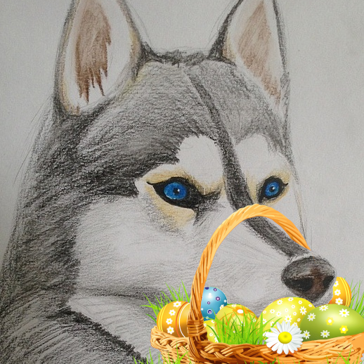

彩蛋意味着复活节，这个很简单。

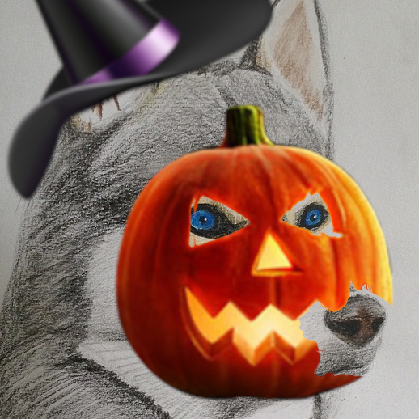

南瓜头意味着万圣节，这个也很简单。

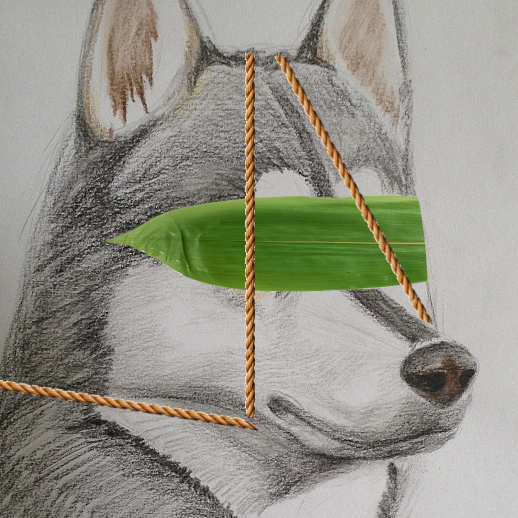

粽叶意味着端午节。

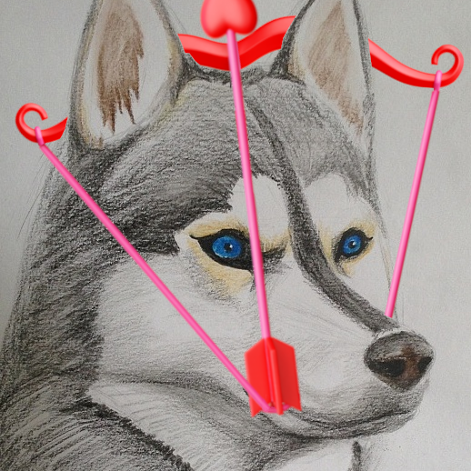

图中丘比特的弓箭是情人节的象征。

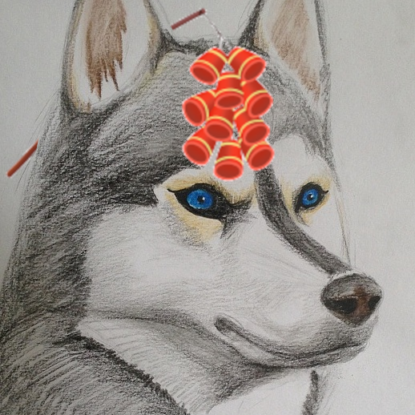

放鞭炮当然是过春节。

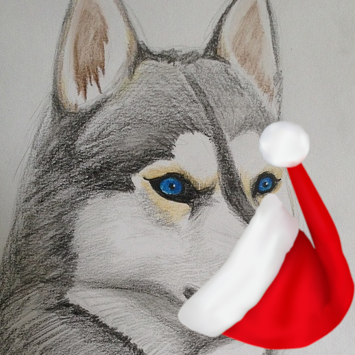

戴圣诞帽当然是过圣诞节。

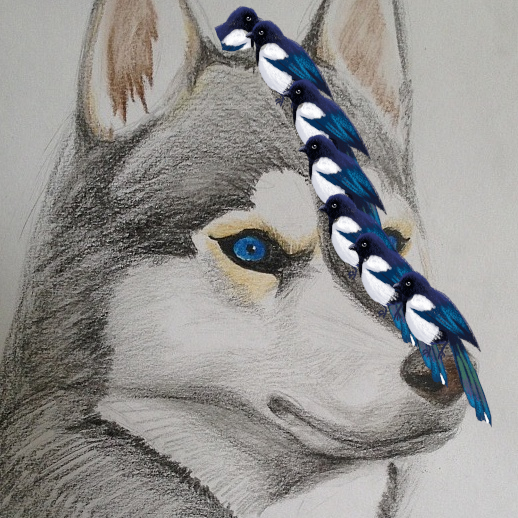

这个头像被评价为太过后现代了，大家很难看懂。其实它描绘的是一群喜鹊在搭桥，所以是七夕节的“鹊桥”。

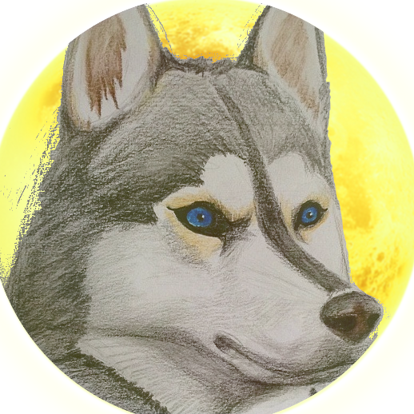

背后巨大的月亮当然是中秋节的象征。

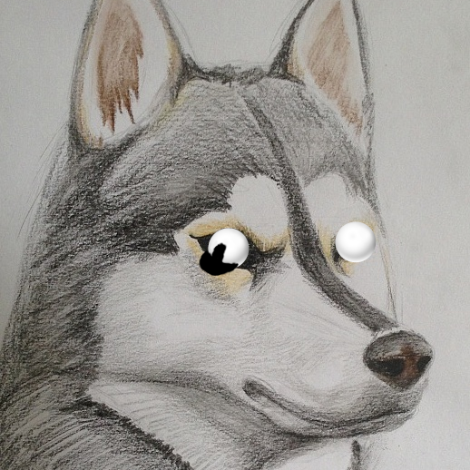

虽然并不是只有元宵节存在吃元宵的习俗，但元宵节无疑是其中最重要的一个。

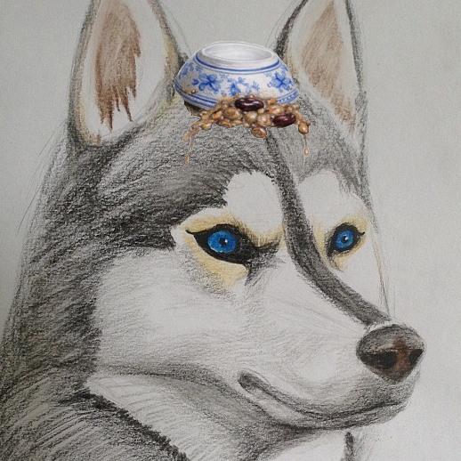

腊八粥都扣头上了，只能是腊八节吧。

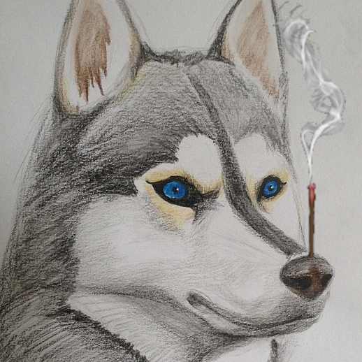

清明节上柱香，祭拜一下。

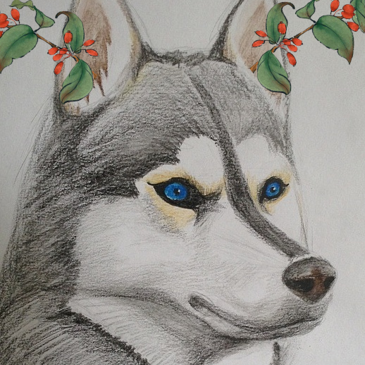

这个也是很难猜的，其实耳中所插是茱萸。
