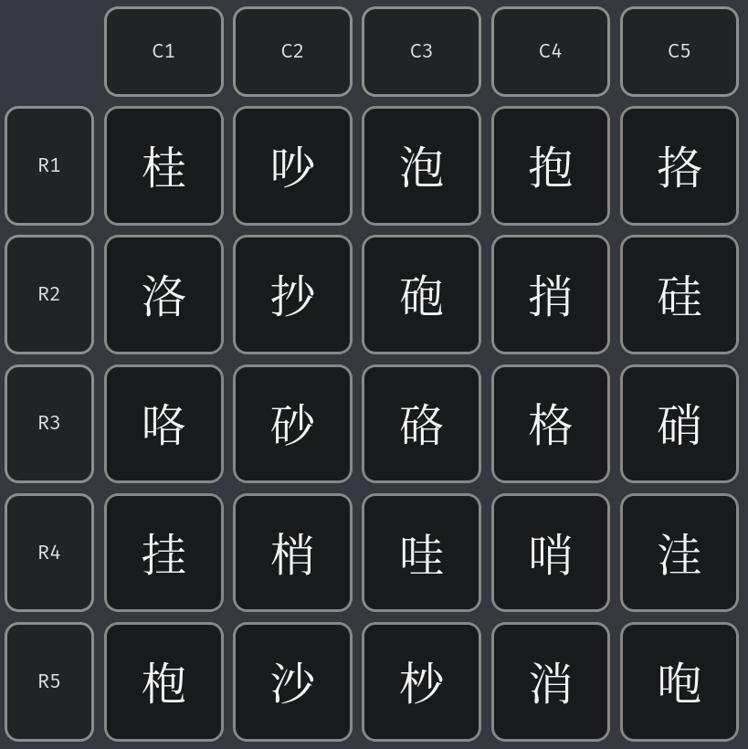

# SwitchAndTranspose

> 有一个 $5\times5$ 汉字矩阵，其中所有 25 个字都是左右结构的。你可以对该矩阵执行以下操作：
>
> - Row Switching：交换矩阵的两行；
> - Column Switching：交换矩阵的两列；
> - $2\times2$ Submatrix Transposing：选定一个 $2\times2$ 子矩阵，进行转置。
>
> 你需要通过反复进行以上操作，实现：
>
> - 一行的左偏旁相同；
> - 一列的右偏旁相同。
>
> 

本关并不如它初看起来的那样难，稍微花一些时间就能解决；而且也没有什么解题新花样，我就不赘述了。下文只证明任何一个这样的问题都有解，以及给出一定可解的方案。如果想要优化，就请自行探索吧。

<iframe src="//player.bilibili.com/player.html?isOutside=true&aid=116089946114139&bvid=BV1H6ZQBFEWz&cid=36136683823&p=3" scrolling="no" border="0" frameborder="no" framespacing="0" allowfullscreen="true"></iframe>

## 解析

### 置换群及其基本元素

这是一个置换群问题。例如，我们可以把 $\left(\begin{matrix}a_{11}&a_{12}\\a_{21}&a_{22}\end{matrix}\right)$ 上的转置记作 $(a_{12}\,a_{21})$。括号中表示的是一个**循环**，即前一个元素所在位置由下一个元素代替，最后一个元素所在位置由第一个元素代替。

再比如，第1、2行置换可以记为 $(a_{11}\,a_{21})(a_{12}\,a_{22})(a_{13}\,a_{23})(a_{14}\,a_{24})(a_{15}\,a_{25})$。简洁起见，我们简写为 $r_{12}$。列置换同理，我们简写为 $c_{ij}$。

定义置换群 $G$ 表示在这个汉字矩阵中能进行的所有置换。特别地，$()$ 表示不做任何操作，这也是 $G$ 的单位元。乘法运算符 $\cdot$ 表示左操作循环和右操作循环的叠加。注意到它不满足交换率，但若左操作数和右操作数中没有相关元素，它们也可以交换。

根据上面的举例我们知道，所有的 $r_{ij},c_{ij}$ 都是 $G$ 的元素。但注意，$(a_{11}\,a_{21})(a_{12}\,a_{22})...(a_{15}\,a_{25})\in G$不意味着$(a_{11}\,a_{21})\in G$。如果我们要下此论断，还得严格证明才行。

我们希望这个矩阵中的任意两个元素都是可置换的（仅置换这两个元素，而其它元素位置不变），即 $\forall i,j,m,n,(a_{ij},a_{mn})\in G$。而我们已经知道：
- $\forall i,j,r_{ij}\in G$（置换一整行）；
- $\forall i,j,c_{ij}\in G$（置换一整列）；
- $\forall i,j,(a_{ij}\,a_{(i-1)(j+1)})\in G$（置换次对角方向的相邻元素）。

那么接下来我们的目标就是找到更多属于 $G$ 的元素。

### 可置换关系

汉字矩阵上两个位置的元素可置换，这是一个二元关系。我们定义二元关系“可置换”，表示在矩阵中仅置换这两个元素，且其它元素位置不变，记为 $\leftrightarrow$。$a\leftrightarrow b$ 当且仅当 $(a\,b)\in G$。

可置换关系具有传递性，即如果 $a\leftrightarrow b,b\leftrightarrow c$，那么 $a\leftrightarrow c$。证明很简单：$(a\,b)(b\,c)(a\,b)=(a\,c)\in G$。

我们已经知道次对角方向的相邻元素可以置换。根据可置换关系的传递性可以推出，**同在一个次对角线上的所有元素都可以置换**。举个例子，如果要置换 $a_{14}$ 和 $a_{41}$，只需要这样：

$$(a_{14}\,a_{23})(a_{23}\,a_{32})(a_{32}\,a_{41})(a_{23}\,a_{32})(a_{14}\,a_{23})=(a_{14}\,a_{41})$$

### 主对角线方向的置换

转置操作只能置换次对角线上的相邻元素；要实现主对角线上元素的置换，就要另寻他法。

不妨思考，如果把需转置的两行先置换一次，原本在主对角线上的两个元素不就到次对角线上了吗？这样就可以置换它们了。最后只需再把这两行置换回来，就可以保证两个目标元素得到置换，且其它元素位置不变。

举个例子，假如我们要置换 $a_{14}$ 和 $a_{25}$：

$$r_{12}(a_{24}\,a_{15})r_{12}=(a_{14}\,a_{25})\in G$$

现在我们能证明主对角线方向上的相邻元素是可置换的。根据可置换关系的传递性，我们得到结论：**同在一个主对角线上的所有元素都可以置换**。

根据传递性，我们进一步得到结论：**通过对角线方向可达的任意两个元素都是可置换的**。

### 沿行/列方向的置换

接下来我们要证明同行的相邻元素是可置换的。因为行与列在本问题中地位相等，所以证明了行方向上可置换，就能证明列方向上可置换。

以 $a_{21}$ 和 $a_{22}$ 为例：

$$(a_{13}\,a_{22})c_{23}(a_{12}\,a_{21})c_{23}(a_{13}\,a_{22})=(a_{21}\,a_{22})\in G$$

如果要置换 $a_{11}$ 和 $a_{12}$ 呢？可以先把第一行置换到第二行，再如法炮制，最后置换回去就好了。

$$r_{12}(a_{21}\,a_{22})r_{12}=(a_{11}\,a_{12})\in G$$

现在我们能证明沿行/列方向上的相邻元素是可置换的。根据可置换关系的传递性，我们得到结论：**同在一行/一列上的所有元素都可以置换**。进一步通过传递性可以得到结论：**任意两个元素都可以置换**。

一般来说，沿对角线方向进行置换所需的步数较少。所以在实操过程中，建议先沿对角线方向移动，使要置换的两个元素靠近，再沿行/列方向进行移动。
