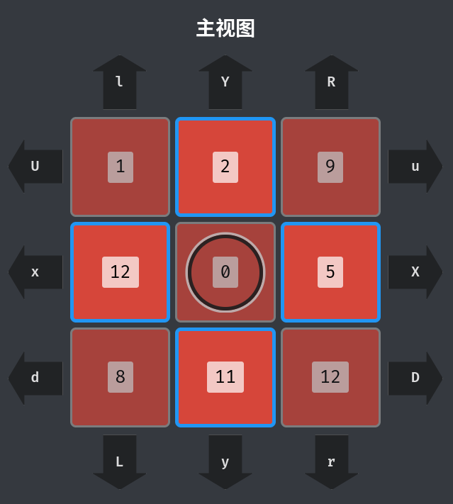
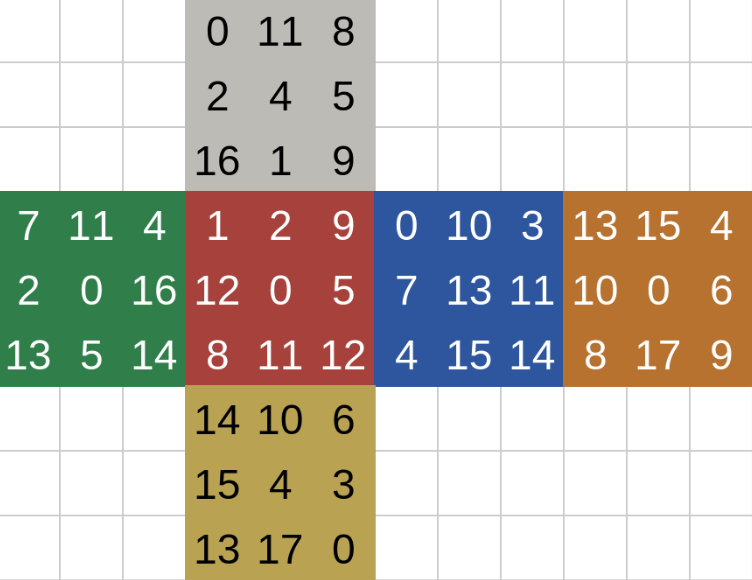

# UnoRubik

> 你在一个三阶魔方表面的格子上移动，需要从初始位置起，走到目标位置橙色的0。
> 
> 你可以旋转这个三阶魔方，其规则与一般三阶魔方无异。但你在魔方格子之间的移动受到以下规则的限制：
> 
> - 你只能在同一个面的格子间移动；
> - 你只能移动到上、下、左、右直接相邻的格子上；
> - 你只能移动到颜色相同，或数字相同的格子上。
>
> 

## 思路

在本题中，你只能看到魔方的主视图，所以首要工作是掌握它的全貌。直接翻面把所有面都过一遍就好了。

因为起点和终点所在格的颜色不同，所以至少需要用到一次“相同数字”的规则来实现跨颜色的移动。

而红格和橙格间的共同数字只有0和9，于是我们自然期望通过0或9来实现跨颜色。

但试过之后就会很快发现问题所在：无论怎么转魔方，你也不能一次性从红0/9走到橙0/9。原因在于，它们**不具备位置上相邻的可能性**。

为了便于分析，我们将魔方表面的 54 个格分为两大类：

- I 类格分布于每个面的四角和中心，共 30 个；
- II 类格分布于每个面的棱上，共 24 个。

不难发现：**I 类格只能与 II 类格相邻，反之亦然。**

所以红9和橙9都是 I 类格，它们就不可能相邻，也不存在一步走到的可能性。

因此要实现跨颜色移动，必须要找到两个相同数字，而且它们一个在 I 类格上，一个在 II 类格上。

接下来对魔方所有格上的数字进行统计，发现：

|颜色|I 类格|II 类格|
|---|---|---|
|红|0, **1**, 8, 9, 12|2, 5, 11, 12|
|白|0, 4, 8, 9, **16**|**1**, 2, 5, 11|
|绿|0, 4, **7**, 13, 14|2, 5, 11, **16**|
|蓝|0, **3**, 4, 13, 14|**7**, 10, 11, 15|
|黄|0, 4, **6**, 13, 14|**3**, 10, 15, 17|
|橙|0, 4, 8, 9, 13|**6**, 10, 15, 17|

因此无论怎么规划路线，必定经过的几步移动都是：

- 从红 0 出发先移动到红 1；
- 借助数字 1 从红格移动至白格；
- 借助数字 16 从白格移动至绿格；
- 借助数字 7 从绿格移动至蓝格；
- 借助数字 3 从蓝格移动至黄格；
- 借助数字 6 从黄格移动至橙格；
- 最后移动到橙 0。

理解以上原理后，实际移动时，只需通过合理的旋转，将两个相同数字的异色格转至相邻位置，即可实现跨色移动；再通过相同颜色的格子作为中介，实现跨数字移动即可。
